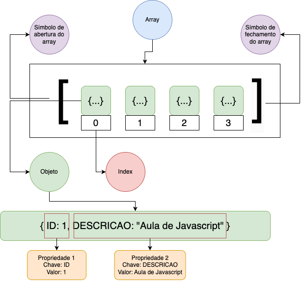

# FUNDAMENTOS DO JS:

## História de JS
- 1997: ECMAScript - padronização do Javascript
- 2015: ES6/ES2015 traz let/const, arrow functions, classes, promises e muito mais.
- 2016/2024: JavaScript se expande para servidores (Node.js), aplicações móveis e desktop.

## Tipos de Console e quais suas utilizações:

- ``console.log("mensagem normal")``
- ``console.info("aviso")``
- ``console.warn(aviso importante)``
- ``console.error("erro grave")``
### Utilidade publicas:

- Criar tabela no console
  ``console.table([{id: 1, tarefa: "Estudar JS"}])``
> usado para aparecer uma tabela ao inves de chaves no console.
>> muito util pra consumir API´S

- Marcar tempo
    ~~~javascript
      console.time("Timer");
      // ...algum processamento...
      console.timeEnd("Timer");
    ~~~

> Utilizado para marcar quanto tempo demora um processamento

## Explicação sobre variaveis:

- string (textos)
- number (números)
- boolean (verdadeiro ou falso)
- undefined (valor não atribuído)
- null (valor nulo intencional)
- symbol (identificador único - ES6)
- bigint (inteiros muito grandes - ES2020)

~~~
    let texto = "Olá";                
    // String: sequência de caracteres.

    let numero = 42;                  
    // Number: valores numéricos.

    let isCompleted = false;          
    // Boolean: verdadeiro ou falso.

    let semValor;                     
    // Undefined: variável declarada sem valor.

    let nulo = null;                  
    // Null: ausência intencional de valor.               
    // (typeof null retorna "object", comportamento histórico do JS)

    let uniqueId = Symbol("id");      
    // Symbol: cria um identificador único.

    let bigNumero = 999999999999999999999999n; 
    // BigInt: para inteiros muito grandes.   
~~~

## Explicação sobre Arrays:

## Operador Ternário:

- condição ? Resultado se verdadeiro : Resultado se falso

~~~
    let idade = 18;
    let status = idade >= 18 ? "Maior de idade" : "Menor de idade";
~~~